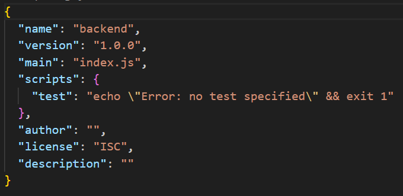
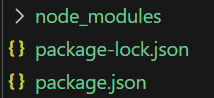

## <基礎題>
### package.json 中的 dependencies 與 devDependencies 分別是什麼

軟體生命週期有分為開發以及運行階段。開發階段包括編寫程式碼、單元測試、代碼審查、使用開發工具和框架等。運行階段包括部署應用程式、監控和維護系統、處理實際用戶請求等。

- dependencies
    - 用於運行階段，包含了運行時需要用到的函示庫以及框架，例如我們使用的express框架就會被歸類到dependencies裡面。
- devDependencies
    - 用於開發階段，比較常看到的像是Mocha(測試工具)以及ESLint(程式碼檢查工具)，都會被列到devDependencies裡面。
    - 會使用 ```npm install <package name> --save-dev``` 來把 package 加入到devDependencies裡面。

注意: 
- dependencies 跟 devDependencies 有可能會包含相同的 package，因為一個工具可能同時在開發以及運行都會被用到。
- 有些應該要屬於devDependencies的 package 卻忘了使用```--save-dev```來安裝也會出現問題，可能會有安全風險以及維護上的困難(很籠統的講)。

### package.json 中的 scripts 這個區塊怎麼用？

我們在寫javaScript的時候是使用Node來開發，而Node跟npm有著緊密的關係，其中腳本功能就是npm的其中一項功能。在終端機我們可以執行 ``` npm run [someting]```，這裡的 [something]就可以定義在package.json裡面的scripts中。

```json
// this is package.json
{
  "scripts": {
    "start": "node app.js"
  }
}

```

例如上方我們定義了 start 等於 node app.js ，那麼使用終端機的時候我們就可以用```npm run start```來執行 app.js ，它就會等同於在終端機下```node app.js```的指令。

還有許多常見的腳本功能，像是 build，我們一樣可以使用```npm run build```來執行定義在 scripts 裡面的 build。
```json
// this is package.json
{
  "scripts": {
    "build": "webpack --config webpack.config.js"
  }
}
```

而build又可以延伸出更厲害更方便的腳本定義方式，如下方，這時我如果執行```npm run build```，則會先執行 prebuild 裡面的內容，接著再執行 build 的內容，最後執行 postbuild 的內容。從這個例子就可以發現腳本定義的好處。
```json
{
  "scripts": {
    "prebuild": "echo 'Running before build'",
    "build": "webpack --config webpack.config.js",
    "postbuild": "echo 'Running after build'"
  }
}
```

### Port number 要怎麼以環境變數來設定？

在程式碼裡面可以運運下面的程式來動態給予 Port number 。
```js
const port = process.env.PORT;
```
並且在終端機(我的是Windows pwsh)以下方的指令完成附值。
```
$env:PORT = 4000; node app.js
```

另一種方法是先```npm install dotenv```，並且在根目錄底下新增一個 .env 檔案，在檔案裡寫一行```PORT=3000```，並且在app.js裡改寫一下，如此一來就可以在終端機直接下```node app.js```的指令，程式就會自動找到 .env file 裡面的 PORT 號碼。
```js
// this is app.js
const dotenv = require('dotenv');
dotenv.config();
const port = process.env.PORT;
```

### 關於哪些檔案應該要被放上 github repo 這個問題，描述看看為什麼你選擇上傳某些檔案、選擇不上傳某些檔案，決策的要素是什麼？


### 範例程式中用 require，但上週的 Stack 是用 import/export，這兩種分別是 JavaScript 引用模組的兩種方式: CJS vs ESM，這兩者分別怎麼用？

NodeJS 是 2009 年正式發表的，而ES Modules 是 2015 才成為標準。在 Node.JS v12.17 之前使用的是 CommonJs Modules (CJS) 系統，之後版本才支援 ECMAScript Modules(ECM)，而現在通常使用 ECM。
兩者的差別在於import以及export方式不同，我們可以從檔名來辨別目前使用的是哪種方法，使用CJS方法時我們會把檔名取為 .cjs，而使用ESM時我們會把檔名取為 .mjs，一般情況下檔案會是 .js，預設狀況來說這會是使用 CJS 的方式，如果我們想要把它變成 ESM，則需要在 package.json 中加上```"type": "module"```。

CJS: 使用 require 函數來導入模塊，並使用 module.exports 或 exports 對象來定義導出的內容。以下為網路參考的範例，可以看到使用```exports.add```方法來把add function導出。並用```require('./math.js')```來導入。

```js
// 定義module
// math.js
exports.add = function(a, b) {
  return a + b;
};

// 導入module
// main.js
var math = require('./math.js');
console.log(math.add(2, 3)); // 輸出: 5
```

ESM: ESM 使用 import 和 export 關鍵字來定義和導入模塊。以下為網路參考的範例，可以看到使用 import 以及 export 來實現模塊之間的交流。

```js
// 定義 module
// math.js
export function add(a, b) {
  return a + b;
}

// 導入 module
// main.js
import { add } from './math.js';
console.log(add(2, 3)); // 輸出: 5
```

補充:
- ESM 可以在現代瀏覽器中使用，CJS 主要用於 Node.js 環境。
- ESM 和 CJS 是不相容的模塊系統
- ESM 通常在性能上更有優勢，因為它的靜態加載和非阻塞特性會讓模塊加載更高效。
- CJS 因為動態和同步加載，可能會在初次加載時導致性能瓶頸。

---

## <進階題>

### localhost 是什麼？
### curl 是什麼？查查看怎麼用 curl 來測試網路連線？常用參數有哪些？

---

## 觀察package.json

執行npm init會多了一個package.json檔。


執行npm install express會多出一個node_modules資料夾以及一個package-lock.json檔案。


package.json會比npm init時多出一個dependencies。

```json
"dependencies": {
    "express": "^4.21.0"
}
```

node_modules裡面有什麼???