# git相關知識

## 目錄
- [git組成要件](#git組成要件)
- [了解.git file](#了解.git資料夾)
- [HEAD](#HEAD)
- [blob](#blob)
- [tree](#tree)
- [commit](#commit)
- [branch](#branch)
- [CommitMessage撰寫](#CommitMessage撰寫)

### git組成要件

git物件主要有四種類型:

- Blob物件
- Tree物件
- Commit物件
- Tag物件

有了這些物件就可以構成完整的Git資料結構，達到版本控制的效果。

想要使用cmd來研究個個物件，以下是一些重要指令。
```
$ git cat-file -t <sha-1 value>  #顯示該sha1 value是屬於那一種物件
$ git cat-file -p <sha-1 value>  #顯示該sha1 value物件的內容
```

### 了解.git資料夾

.git資料夾是Git版本控制系統用來儲存專案的版本歷史、配置和元數據(metadata)的隱藏目錄。

新專案git init之後最原始的情況會長這樣:
\

### HEAD

在git init之後可以看到HEAD file裡面顯示出以下資訊。
```
ref: refs/heads/master
```
這代表我們目前所在的位置，以此例來說，我們目前是在master branch。

更仔細分的話，HEAD指標可以分為attached或者detached，若是attached的狀況(預設)，會指向我們正在操作的branch。而若是detached的話，則會指向某一個commit。

想知道HEAD目前指向哪裡的話，可以使用```git show HEAD --oneline```或者是```git status```。

此圖顯示HEAD->featGitMD，代表目前指到featGitMD branch，也就是屬於attached的模式。


當我強制切換到某一個commit的時候，可以看到HEAD就會變成detached模式。
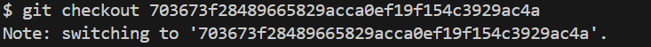
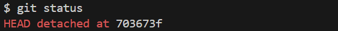

若想要回到原本的attached模式，只要重新切回到branch就可以了。如下面操作。
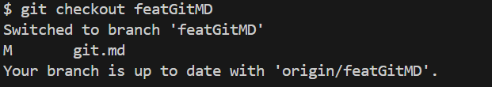
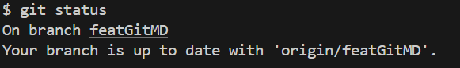

所以當看到```You are in 'detached HEAD' state```的時候，並不是代表做錯了什麼事情，而是HEAD目前指向了某一個commit而不是branch。

同時觀察了.git資料夾裡面HEAD的資訊，可以發現每當我們切branch的時候HEAD顯示的資訊就會及時改變。所以有了HEAD這個檔案就能讓我們更清楚目前是在執行專案的哪一個環節。

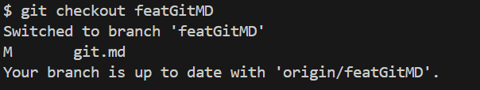
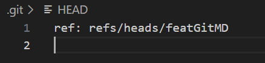

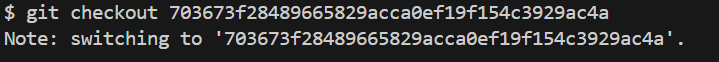
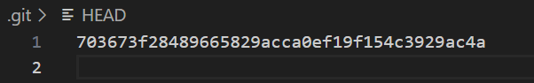

ref:
[參考文章1](https://blog.simonxander.tw/2023/12/dot-git-folder-part-1.html)
[參考文章2](https://www.git-tower.com/learn/git/glossary/head)
[參考文章3](https://blog.git-init.com/what-is-head-in-git/)

### blob

def: (Binary Large Object)，是 Git 中的一種物件類型，專門用來儲存檔案的內容

blob會被儲存在objects資料夾裡面，最一開始objects資料夾裡只有info和pack，而沒有其他的檔案資訊，如下圖。
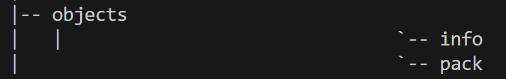

假如我commit一個新的檔案之後，就會出現變化。以下是新增一個hello.py檔案並且commit後的結果。

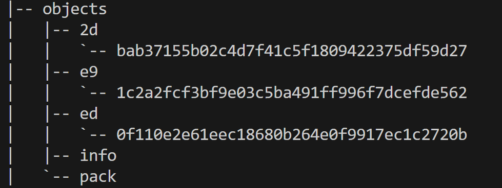

執行以下指令就可以解碼內容，可以看出內容就是在記錄我們什麼時候commit了一個版本以及增加了什麼檔案和內容是什麼。
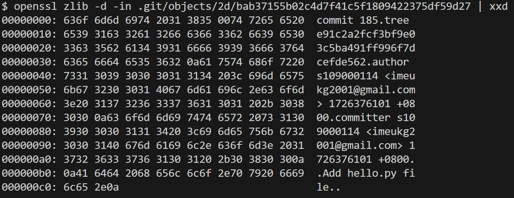
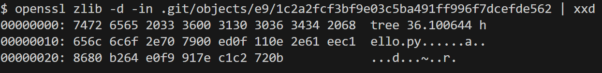
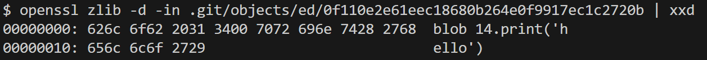

若單純使用```git add .```，也會發現objects內容有所變化，會多了一個blob物件，原因就是git幫忙記錄了你所新增的內容。

ref:
[參考資料1](https://blog.simonxander.tw/2023/12/dot-git-folder-part-2.html)

### tree

tree object可以儲存資料的結構以及檔名(blob則是用來儲存檔案內容)

下圖是經過一次commit之後的objects內容。
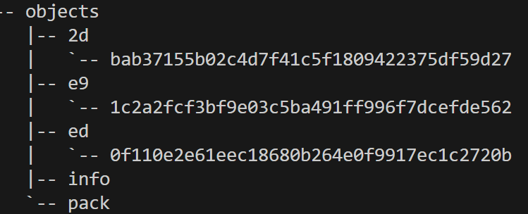

透過指令可以發現包含了commit、tree、blob物件。
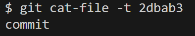
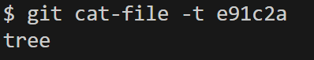
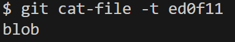

可以看到tree object的內容是一個blob object，並且這個blob顯示出裡面的檔案是```hello.py```。

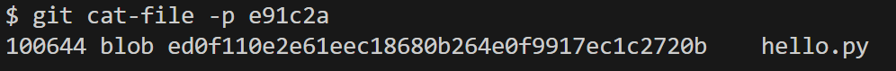

ref:
[參考資料1](https://titangene.github.io/article/git-tree-object.html)
[參考資料2](https://medium.com/@flyotlin/%E4%BB%80%E9%BA%BC%E6%98%AFgit%E7%89%A9%E4%BB%B6-ebbeb3b22f9c)

### commit 

Commit object是進行commit後會出現的物件，記錄了某個特定時間點的狀態的對象。

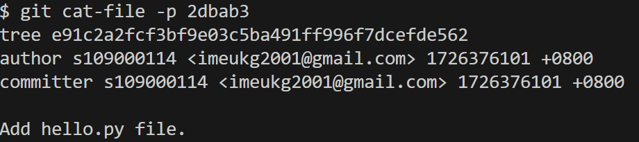

觀察這個commit object可以發現裡面的內容是一個tree object，我們最後可以得到一個結論是提交一個commit之後，commit object會指向tree object，而tree object又會指向blob obect來顯示某個時刻的資料內容，這樣就可以成功紀錄每一個時刻的狀態，也就可以達到回朔的效果。可以用下圖表示。

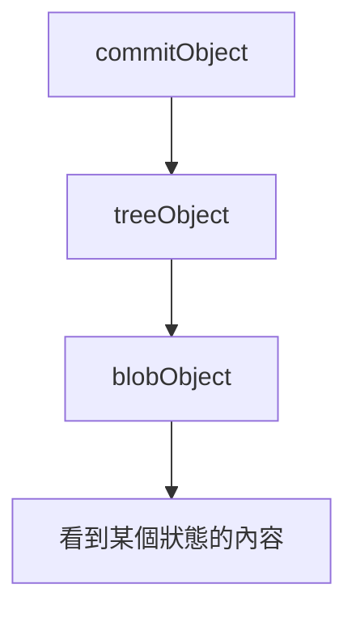

ref:
[參考文章1](https://medium.com/@flyotlin/%E4%BB%80%E9%BA%BC%E6%98%AFgit%E7%89%A9%E4%BB%B6-ebbeb3b22f9c)

### branch

Def: A branch in Git is simply a lightweight movable pointer to one of these commits and also a snapshot of your changes.

在協作專案的時候每個人負責一個分支，並且最後合併到主分支，這樣才可以減少衝突，並確保代碼的穩定性。

Branch大致上可以分成Master、Dev、Feature、Release、Bug。

Master: 所有可供使用者使用的正式版本都在此主分支上發布。
Dev: 最新、功能最齊全的日常開發分支。如果要正式發布的話，會合併回master分支。
Feature: 開發新功能的分支。
Release: 在正式合併到master之前，釋出定期要上線的版本，release通常是從dev上分支出來的，預釋出結束後，要合併回master和dev。
Bug: 正式釋出後，用於修復線上程式的bug，修復完成後，再合併回master和dev。

### CommitMessage撰寫

看了蠻多篇文章介紹後，發現大家給的建議都是大同小異。如下表。

```html
Header: <TYPE>(<SCOPE>): <SUBJECT>

Body: 72-character wrapped.

Footer: ......
```

**Header**

由type、scope、subject所組成。

type代表commit的類別，通常有以下幾種:
- feat: 對專案做了哪些新增、修改 (Feature)。
- fix: 修復了那些功能 (Bug Fix)。
- docs: 對專案撰寫文件 (Documentation)。
- style: 撰寫格式改動 (不影響程式碼運行的變動 white-space, formatting, missing - semi colons, et.)。
- refactor: 重構 (既不是新增功能，也不是修補 bug 的程式碼變動)。
- perf: 改善效能 (A code change that improves performance)。
- test: 增加測試 (when adding missing tests)。
- chore: 建構程序或輔助工具的變動 (maintain)。
- revert: 撤銷回覆先前的 commit 例如：revert: type(scope): subject (回覆版本：xxxx)。

scope代表commit影響的範圍。

subject則是commit的簡短描述，不超過 50 個字元，結尾不加句號

**Body**

對本次 Commit 的詳細描述，可以分成多行，每一行不要超過 72 個字元。說明程式碼變動的項目與原因，還有與先前行為的對比。

**Footer**

填寫任務編號(如果有的話)，
BREAKING CHANGE（可忽略），記錄不兼容的變動，
以 BREAKING CHANGE: 開頭，後面是對變動的描述、以及變動原因和遷移方法。

---

以下為一些網路上的範例:

```
test: email validation

There are several unit tests for the email validation feature:
1. Test the email validation function with invalid email addresses.
2. Test the email validation function with valid email addresses.

Issue: #3456
```

```
docs: email validation

We have added documentation for the email validation feature:
1. Add the Tech Stack documentation.
2. Add the User Guide documentation.
3. Add the API documentation.

Issue: #4567
```