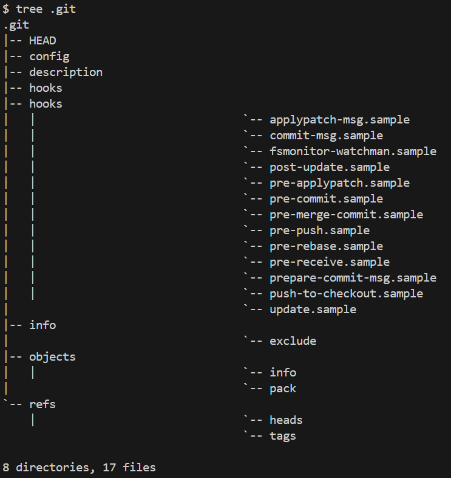
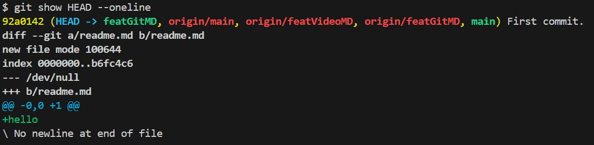

# git相關知識

## .git file
最原始的情況會長這樣


## HEAD

在git init之後可以看到HEAD file裡面顯示出以下資訊。
```c
ref: refs/heads/master
```
這代表我們目前所在的位置，以此例來說，我們目前是在master branch。

更仔細分的話，HEAD指標可以分為attached或者detached，若是attached的狀況(預設)，會指向我們正在操作的branch。而若是detached的話，則會指向某一個commit。

想知道HEAD目前指向哪裡的話，可以使用```git show HEAD --oneline```或者是```git status```。

此圖顯示HEAD->featGitMD，代表目前指到featGitMD branch，也就是屬於attached的模式。


[參考文章1](https://blog.simonxander.tw/2023/12/dot-git-folder-part-1.html)
[參考文章2](https://www.git-tower.com/learn/git/glossary/head)
[參考文章3](https://blog.git-init.com/what-is-head-in-git/)