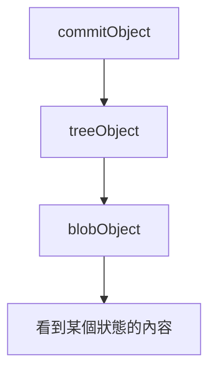

# git相關知識

## 目錄
- [git組成要件](#git組成要件)
- [了解.git file](#了解.git資料夾)

### git組成要件

git物件主要有四種類型:

- Blob物件
- Tree物件
- Commit物件
- Tag物件

有了這些物件就可以構成完整的Git資料結構，達到版本控制的效果。

想要使用cmd來研究個個物件，以下是一些重要指令。
```c
$ git cat-file -t <sha-1 value>  #顯示該sha1 value是屬於那一種物件
$ git cat-file -p <sha-1 value>  #顯示該sha1 value物件的內容
```

### 了解.git資料夾
最原始的情況會長這樣
\

### HEAD

在git init之後可以看到HEAD file裡面顯示出以下資訊。
```c
ref: refs/heads/master
```
這代表我們目前所在的位置，以此例來說，我們目前是在master branch。

更仔細分的話，HEAD指標可以分為attached或者detached，若是attached的狀況(預設)，會指向我們正在操作的branch。而若是detached的話，則會指向某一個commit。

想知道HEAD目前指向哪裡的話，可以使用```git show HEAD --oneline```或者是```git status```。

此圖顯示HEAD->featGitMD，代表目前指到featGitMD branch，也就是屬於attached的模式。


當我強制切換到某一個commit的時候，可以看到HEAD就會變成detached模式。


若想要回到原本的attached模式，只要重新切回到branch就可以了。如下面操作。


所以看到```You are in 'detached HEAD' state```的時候，並不是代表做錯了什麼事情，而是HEAD目前指向了某一個commit而不是branch。

同時觀察了.git資料夾裡面HEAD的資訊，可以發現每當我們切branch的時候就會及時改變。


ref:
[參考文章1](https://blog.simonxander.tw/2023/12/dot-git-folder-part-1.html)
[參考文章2](https://www.git-tower.com/learn/git/glossary/head)
[參考文章3](https://blog.git-init.com/what-is-head-in-git/)

### blob(Binary Large Object)

def: 是 Git 中的一種物件類型，專門用來存儲檔案的內容

blob會被儲存在objects資料夾裡面，最一開始objects資料夾裡什麼東西都沒有，如下圖。


假如我commit一個新的檔案之後，就會出現變化。以下是新增一個hello.py檔案並且commit後的結果。


執行以下指令就可以解碼內容，可以看出內容就是在記錄我們什麼時候commit了一個版本以及增加了什麼檔案和內容是什麼。


若單純使用```git add .```，也會發現objects內容有所變化，原因就是git幫忙記錄了你所新增的內容。

ref:
[參考資料1](https://blog.simonxander.tw/2023/12/dot-git-folder-part-2.html)

### tree

tree object可以儲存資料的結構以及檔名(blob則是用來儲存檔案內容)

下圖是經過一次commit之後的objects內容。


透過指令可以發現包含了commit、tree、blob物件。


可以看到tree object的內容是一個blob object，並且紀錄他的名字是hello.py。


ref:
[參考資料1](https://titangene.github.io/article/git-tree-object.html)
[參考資料2](https://medium.com/@flyotlin/%E4%BB%80%E9%BA%BC%E6%98%AFgit%E7%89%A9%E4%BB%B6-ebbeb3b22f9c)

### commit 

Commit object是進行commit後會出現的物件，記錄了某個特定時間點的狀態的對象。


觀察這個commit object可以發現裡面的內容是一個tree object，我們最後可以得到一個結論是提交一個commit之後，commit object會指向tree object，而tree object又會指向blob obect來顯示某個時刻的資料內容，這樣就可以成功紀錄每一個時刻的狀態，也就可以達到回朔的效果。可以用下圖表示。



ref:
[參考文章1](https://medium.com/@flyotlin/%E4%BB%80%E9%BA%BC%E6%98%AFgit%E7%89%A9%E4%BB%B6-ebbeb3b22f9c)

### branch

