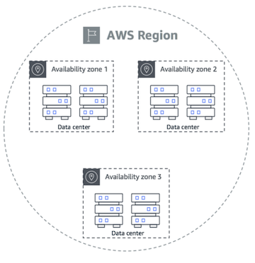

## AWS問題

### 什麼是 AWS Region, AZ (availability zones)

AWS 雲端基礎設施是以 region 以及 availability zones(AZ) 來建置的。 一個 region 包含了很多個 AZ ，每一個 AZ 就是一個可獨立運作的資料中心，通常會有備援電源、聯網和連線能力，而且置放在不同的機構，以分散風險。

### 如果你要使用 AWS 服務，你會怎麼選擇用哪個 Region，考慮的因素有哪些？

以下是我會考慮的點:
- 地理位置
    - 選擇近一點的區域就可以讓網路延遲比較少。
- 成本
    - 想要讓一個產品賺錢當然也要考慮壓低成本。
- 何規性
    - 某些數據可能需要儲存在特定地理位置，才可以符合法律和合規要求。
- AZ 數量
    - 有越多的 AZ 就可以分散風險。
