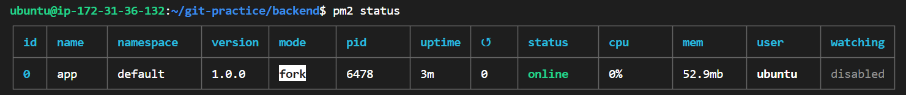
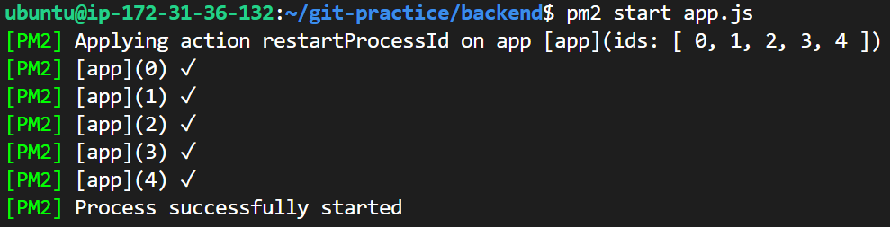
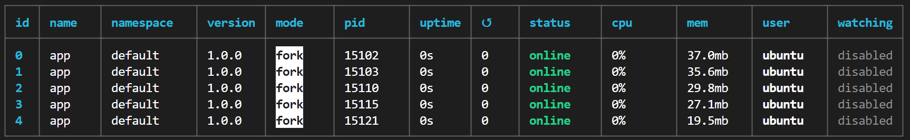
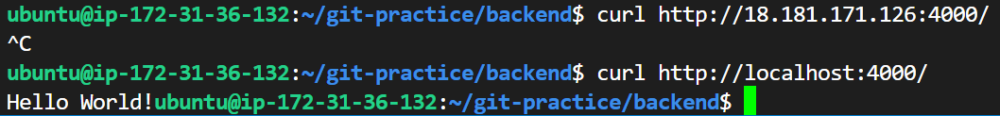
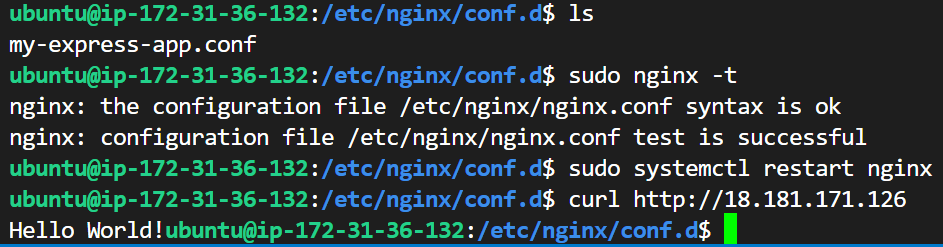
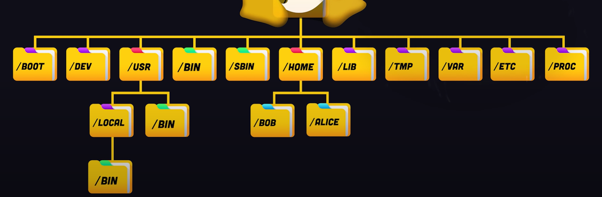

#### 在 Readme 中提供 instance 的 public IP，我會連線過去檢查，所以要保持主機是一直在啟動中

18.181.171.126

#### 什麼是 instance type?

就是 EC2 提供的不同類型的虛擬機器，每個類型都有不同的計算能力、記憶體、儲存和網路能力等等。

#### 什麼是 Nginx？有哪些用途與特性？

Nginx 是一個輕量級的 Web server，它擋在所有後端程式的最前面，通常可以用來做反向代理（Reverse Proxy）、負載平衡（Load Balancing）、Http Cache，所以把 Nginx 應用在微服務架構上非常合適。

#### pm2 套件是什麼？有什麼用處？

pm2 是 Node.js 生態中的主流 app server 之一，可以透過它把 App 喚醒，也可以決定要開幾隻 App 程序來消化負載，也負責在 App 出錯時自動重啟 App。

#### 步驟 9 中提到的 proxy 是什麼意思？為什麼要透過 Nginx 來 proxy 到 Express 開發的 Web Server? (提示 Reverse proxy vs Forward Proxy)

proxy 就是代理伺服器，是 client 跟 server 之間的中介，它可以接收用戶端的請求，然後轉發到目標伺服器，再將回應返回給用戶端。
其實可以不用 nginx，但之所以要透過 Nginx 來 proxy 到 Express 開發的 Web Server 是因為想要達到 Reverse proxy 的功能，也可以解決大流量情況下某個請求應該要給哪一台 server 的問題，這就是所謂的負載平衡，但這次作業還沒用到。<!-- 
-->另外它也可以拿來作為 SSL/TLS 加密、緩存等等的功能，會比前、後端直接溝通的方式還要有更多優點。

#### 在 readme 中提供步驟 9 的 Nginx 設定檔

```yaml
server {
    listen 80;
    server_name 18.181.171.126;

    location / {
        proxy_pass http://localhost:4000;
        proxy_http_version 1.1;
        proxy_set_header Upgrade $http_upgrade;
        proxy_set_header Connection 'upgrade';
        proxy_set_header Host $host;
        proxy_cache_bypass $http_upgrade;
    }
}
```

#### Security Group 是什麼？用途為何？有什麼設定原則嗎？

Security Group 就像是一個虛擬的防火牆，可以針對不同的協議設定規則、也可以控制進出流量、可以知道哪些網路或人可以 access 到這個 EC2。
擷取官網解釋 "Inbound rules control the incoming traffic to your instance, and outbound rules control the outgoing traffic from your instance."。
作業 Inbound rules 設定的 Port 22 就是讓我們的電腦可以利用 SSH 去訪問 EC2，而 Port 80 則是讓我們的電腦可以用 HTTP 去訪問 EC2。

#### 什麼是 sudo? 為什麼有的時候需要加上 sudo，有時候不用？

sudo 是 Linux 和 Unix 系統中的一個命令，它的全稱是 "superuser do"，允許用戶以超級用戶（root）或其他用戶的身份來執行命令。
有時候遇到需要系統管理權限的操作就需要用到 sudo 來暫時提升權限，例如安裝或卸載 package、修改系統配置檔案（如 /etc/hosts）、更改系統範圍的服務狀態（如 systemctl start nginx），有時候系統會要求用戶在執行管理任務時輸入自己的密碼，可以增加安全性。
而有時候我們只是簡單瀏覽檔案 (ls、cat)，或者編輯 home directory 底下的文件，這些操作都不會涉及修改系統或影響其他用戶的資源，就可以不用打 sudo。

#### Nginx 的 Log 檔案在哪裡？你怎麼找到的？怎麼看 Nginx 的 Log？

Log 檔案在 ```/var/log/nginx``` 資料夾裡面，裡面包含 access.log 以及 error.log。
我是實作之前先上網看 Nginx 相關影片，結果剛好裡面就有提到。[影片連結](https://www.youtube.com/watch?v=lZVAI3PqgHc)

沒有特別設定 log 檔的情況下應該會長得像下面的形式。
```
80.65.211.20 - - [12/Oct/2024:12:25:12 +0000] "GET /stackato-pkg/.env HTTP/1.1" 404 156 "-" "Mozilla/5.0 (Macintosh; Intel Mac OS X 10_12_3) AppleWebKit/537.36 (KHTML, like Gecko) Chrome/56.0.2924.87 Safari/537.36"
```
- 80.65.211.20 就是發出請求的 client 的 IP 位址。(我不知道這樣公開是不是正確的，不太懂資安，但我相信小賴不會對我怎樣)
- 接著連續出現兩個 - - 的標示
  - 第一個代表已驗證的使用 (authenticated user)，這邊表示沒有已驗證的使用者
  - 第二個代表使用者名稱 (Username)，這邊代表沒有使用者名稱被提供
- [12/Oct/2024:12:25:12 +0000] 代表的是請求時間
- "GET /stackato-pkg/.env HTTP/1.1"
  - GET 是請求的方式
  - /stackato-pkg/.env 是我們要拿到資源的 URL 的路徑
  - HTTP/1.1 是使用的 HTTP 協議版本
- 404 表示請求的資源沒有被找到
- 156 是伺服器返回的字節數，通常是包含錯誤訊息的內容大小
- "-" 這是引用來源，表示用戶從哪個 URL 來到當前請求的 URL，而這個例子代表沒有引用的來源
- "Mozilla/5.0 (Macintosh; Intel Mac OS X 10_12_3) AppleWebKit/537.36 (KHTML, like Gecko) Chrome/56.0.2924.87 Safari/537.36" 最後這一長串代表客戶端的用戶代理訊息，這裡顯示用戶正在使用一台運行 Mac OS X 10.12.3 的電腦，並使用 Chrome 瀏覽器。

#### 其他你在過程中遭遇的問題，有找到解答就記錄下來，沒有可以把問題放著，下次上課討論。如果沒有遇到任何問題，也可以回答「無」
- 使用 ```ssh -i /path/key-pair-name.pem instance-user-name@instance-public-dns-name```的時候，instance-user-name 我原本一直寫成 ec2-user (很多教學都這樣教)，但就會一直出現 ec2-user permission denied (publickey)。
  - 解決方法就是把 ec2-user 改成 ubuntu 就可以了，原因是要去看 Instance details 裡面的 Platform，在那邊會發現顯示的是 Ubuntu，所以須要把 instance-user-name 改成 ubuntu。
- status 顯示 online 之後為什麼不能直接連到 localhost? 還需要 proxy?
  
- 要連ssh有時候會出現 ssh: connect to host 18.181.171.126 port 22: Connection timed out
  - 去更改 inbound rules，Port 22 的 source 改成 0.0.0.0/0，但其實不確定這樣安不安全，沒什麼概念
- 執行這兩個指令之後```sudo systemctl start nginx```、```sudo systemctl enable nginx```，用 EC2 public ip 進去之後會出現 bad gateway，解決方法就是打```sudo systemctl restart nginx``` 。
  - 後來發現這方法也不是每一次都成功 (哭了都)
  - 因為有動到 nginx 裡面的檔案，所以先解除安裝再安裝一次就可以了(也不確定對不對)。 
- ```pm2 start app.js``` 會有很多個同時啟動，這樣正常嗎?



- 用 pm2 執行 app.js 之後發現用 curl 都沒有反應，所以開了另一個 vscode 測試 HW3 的程式碼，發現也跑不動，原來是 port undefined，所以改了 port number (3000 -> 4000)，但要記得終端機裡面 clone 下來的檔案也要改。
有個問題是為什麼只有終端機可以正確印出 Hellow World! 用瀏覽器都不行?


- 為什麼會 port undefined? 明明之前可以正常運行，但現在要跑卻被占用?這是我可以控制的嗎?之後去了解一下

#### 列出完成本作業時參考的資料
- [video - Permission denied(publickey) 問題](https://www.youtube.com/watch?v=Z-eTvYwWhuc)
- [.conf 檔案要寫在哪裡](https://stackoverflow.com/questions/22143565/which-nginx-config-file-is-enabled-etc-nginx-conf-d-default-conf-or-etc-nginx)
- [ forward & backward proxy ](https://www.jyt0532.com/2019/11/18/proxy-reverse-proxy/) 
- [pm2](https://editor.leonh.space/2023/pm2/)

#### (optional) 如果你很初學，不放心自己的過程是否正確，可以紀錄過程，我會盡量幫忙看

安裝 Nginx，安裝後啟動 Nginx
```bash
sudo apt-get install nginx -y
sudo systemctl start nginx
sudo systemctl enable nginx
sudo systemctl restart nginx
curl http://18.181.171.126
```

透過 npm 安裝 pm2 套件，透過 pm2 啟動上週作業中的 Express server
```bash
# 確保進到 app.js 所屬資料夾
pm2 start app.js -f # -f 是強制
pm2 startup
pm2 save

pm2 stop app # 關掉
pm2 stop [id] # 關掉某個
pm2 delete all
```

最後成功的畫面


一些我自己理解的結論:
nginx 跑在 EC2 上面，所以我們拿到的 EC2 ip address <!-- 
-->就等於是 client，而 nginx 裡面在處理的是我要連接到哪個 web server。

------

#### Linux 相關問題



/etc 是什麼的縮寫？這裡通常都放哪些檔案？

- 它是 Et cetera 的縮寫，也有另一個說法是 Editable text config，所以顧名思義裡面通常會放 .cong 檔案，讓我們可以自由編輯。

/var 這裡通常都放哪些檔案？

- 通常放 variable files，也就是一些 作業系統在運作的時候會更新到的一些檔案，像是 log、cache files。

/boot 這裡通常都放哪些檔案？

- 通常會放可以 boot 系統的檔案。

$PATH 環境變數的作用是什麼？

- 把所有的可執行檔的路徑都包含在內，這樣就可以在任何路徑下執行一些可執行檔，Linux 會自動到 $PATH 裡面搜尋全部路徑，如果執行檔有在其中一個路徑底下，那麼就會被執行。

which 指令的作用？

- 知道某個 binary 在什麼資料夾路徑

------

ssh -i FirstEC2Key.pem ubuntu@18.181.171.126
ssh -i "D:\NCCU\Semester1_1\CloudNative\FirstEC2Key.pem" ubuntu@18.181.171.126