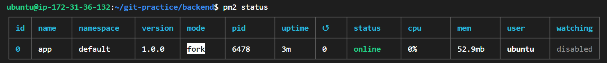
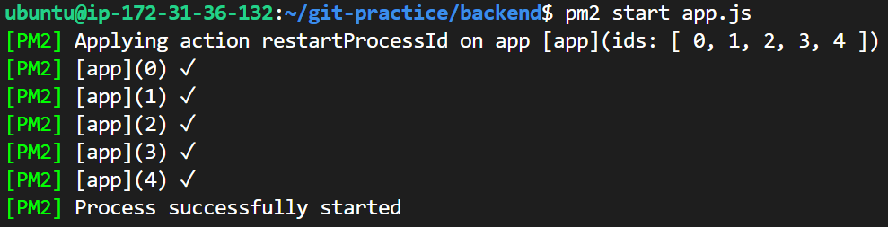
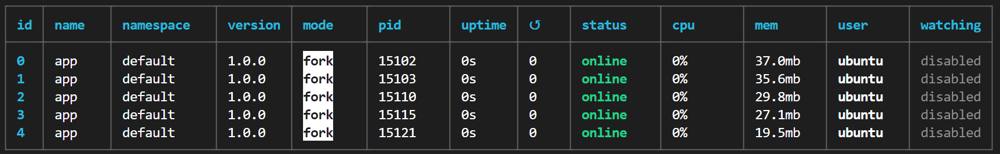
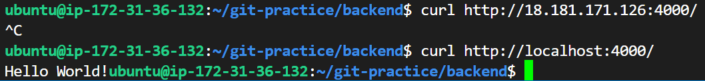
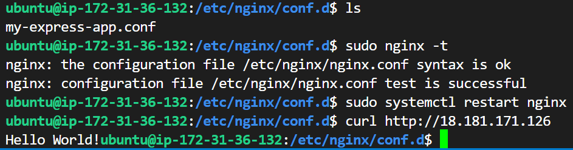

#### 在 Readme 中提供 instance 的 public IP，我會連線過去檢查，所以要保持主機是一直在啟動中
#### 什麼是 instance type?
#### 什麼是 Nginx？有哪些用途與特性？
#### pm2 套件是什麼？有什麼用處？
#### 步驟 9 中提到的 proxy 是什麼意思？為什麼要透過 Nginx 來 proxy 到 Express 開發的 Web Server? (提示 Reverse proxy vs Forward Proxy)
#### 在 readme 中提供步驟 9 的 Nginx 設定檔

```yaml
server {
    listen 80;
    server_name 18.181.171.126;

    location / {
        proxy_pass http://localhost:4000;
        proxy_http_version 1.1;
        proxy_set_header Upgrade $http_upgrade;
        proxy_set_header Connection 'upgrade';
        proxy_set_header Host $host;
        proxy_cache_bypass $http_upgrade;
    }
}
```

#### Security Group 是什麼？用途為何？有什麼設定原則嗎？
#### 什麼是 sudo? 為什麼有的時候需要加上 sudo，有時候不用？
#### Nginx 的 Log 檔案在哪裡？你怎麼找到的？怎麼看 Nginx 的 Log？

Log 檔案在 ```/var/log/nginx``` 資料夾裡面，裡面包含 access.log 以及 error.log。
我是實作之前先上網看 Nginx 相關影片，結果剛好裡面就有提到。[影片連結](https://www.youtube.com/watch?v=lZVAI3PqgHc)

沒有特別設定 log 檔的情況下應該會長得像下面的形式。
```
80.65.211.20 - - [12/Oct/2024:12:25:12 +0000] "GET /stackato-pkg/.env HTTP/1.1" 404 156 "-" "Mozilla/5.0 (Macintosh; Intel Mac OS X 10_12_3) AppleWebKit/537.36 (KHTML, like Gecko) Chrome/56.0.2924.87 Safari/537.36"
```

#### 其他你在過程中遭遇的問題，有找到解答就記錄下來，沒有可以把問題放著，下次上課討論。如果沒有遇到任何問題，也可以回答「無」
- 使用 ```ssh -i /path/key-pair-name.pem instance-user-name@instance-public-dns-name```的時候，instance-user-name 我原本一直寫成 ec2-user (很多教學都這樣教)，但就會一直出現 ec2-user permission denied (publickey)。
  - 解決方法就是把 ec2-user 改成 ubuntu 就可以了，原因是要去看 Instance details 裡面的 Platform，在那邊會發現顯示的是 Ubuntu，所以須要把 instance-user-name 改成 ubuntu。
- status 顯示 online 之後為什麼不能直接連到 localhost? 還需要 proxy?
  
- 要連ssh有時候會出現 ssh: connect to host 18.181.171.126 port 22: Connection timed out
  - 去更改 inbound rules，Port 22 的 source 改成 0.0.0.0/0，但其實不確定這樣安不安全，沒什麼概念
- 執行這兩個指令之後```sudo systemctl start nginx```、```sudo systemctl enable nginx```，用 EC2 public ip 進去之後會出現 bad gateway，解決方法就是打```sudo systemctl restart nginx``` 。
  - 後來發現這方法也不是每一次都成功 (哭了都)
  - 因為有動到 nginx 裡面的檔案，所以先解除安裝再安裝一次就可以了(也不確定對不對)。 
- ```pm2 start app.js``` 會有很多個同時啟動，這樣正常嗎?



- 用 pm2 執行 app.js 之後發現用 curl 都沒有反應，所以開了另一個 vscode 測試 HW3 的程式碼，發現也跑不動，原來是 port undefined，所以改了 port number (3000 -> 4000)，但要記得終端機裡面 clone 下來的檔案也要改。
有個問題是為什麼只有終端機可以正確印出 Hellow World! 用瀏覽器都不行?


- 為什麼會 port undefined? 明明之前可以正常運行，但現在要跑卻被占用?這是我可以控制的嗎?之後去了解一下

#### 列出完成本作業時參考的資料
- [video - Permission denied(publickey) 問題](https://www.youtube.com/watch?v=Z-eTvYwWhuc)

#### (optional) 如果你很初學，不放心自己的過程是否正確，可以紀錄過程，我會盡量幫忙看

安裝 Nginx，安裝後啟動 Nginx
```bash
sudo apt-get install nginx -y
sudo systemctl start nginx
sudo systemctl enable nginx
sudo systemctl restart nginx
curl http://18.181.171.126
```

透過 npm 安裝 pm2 套件，透過 pm2 啟動上週作業中的 Express server
```bash
# 確保進到 app.js 所屬資料夾
pm2 start app.js -f # -f 是強制
pm2 startup
pm2 save

pm2 stop app # 關掉
pm2 stop [id] # 關掉某個
pm2 delete all
```

nginx 跑在 EC2 上面，所以我們拿到的 EC2 ip address 就等於是 client，而 nginx 裡面在處理的是我要連接到哪個 web server。

最後成功的畫面


------

ssh -i FirstEC2Key.pem ubuntu@18.181.171.126
ssh -i "D:\NCCU\Semester1_1\CloudNative\FirstEC2Key.pem" ubuntu@18.181.171.126