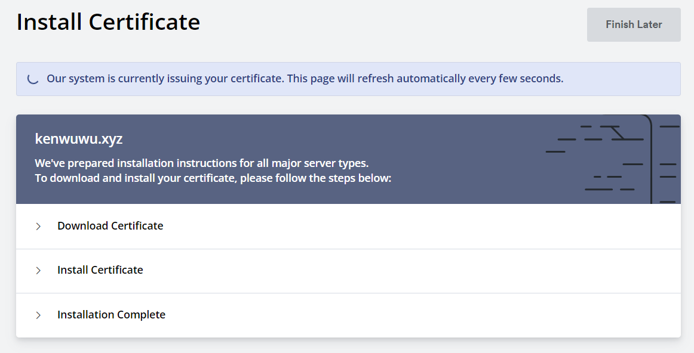
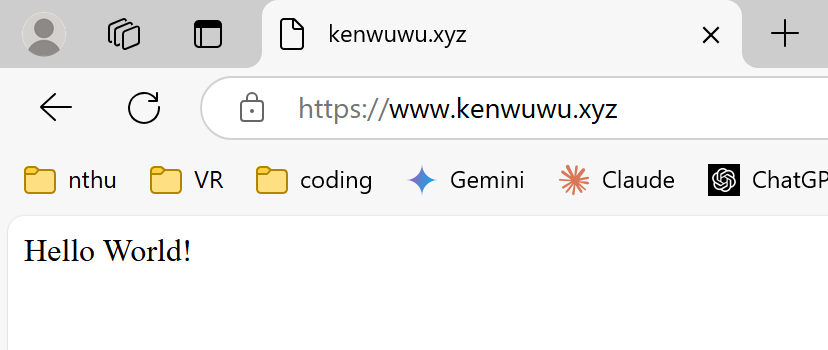

## Week-05

### 網址
[https://www.kenwuwu.xyz](https://www.kenwuwu.xyz)

目前還沒有成功，用了超多次都不行。

終於成功，發現在某個帳號的 Google chrome 輸入 URL一直不能成功，但用無痕模式或者 Edge 瀏覽器就可以成功，有查資料是說Cookies 沒有刪除。(但我超過作業 dealine 了...)

### 你在哪裡購買網域的

namecheap

### DNS 的 A record 是什麼？

DNS 的 A record 是用來把 domain name 對應到 IP 地址的一種紀錄。
例如 domain name 是 example.com 而相對應的 IP 是 192.1.2.1 的話，當在瀏覽器輸入 example.com 時，DNS 伺服器會找到這個域名的 A record，然後轉換為相應的 IP 地址(192.1.2.1)。

### DNS 的 NS record 是什麼？

NS 是名稱伺服器，所以 NS record 是名稱伺服器紀錄，它可以知道哪個 DNS 伺服器對該網域具有權威性。

### Domain Name vs FQDN vs URL 這三者分別為何？

Domain Name（域名）是網路上用來標識網站或服務的名字，讓人比較好辨識。
FQDN（完全合格域名）是完整的域名，包括子域名、次級域名和頂級域名。
URL（統一資源定位符）是網頁資源的完整地址，包括協議（http 或 https）、端口號、路徑等。它可以明確指示如何訪問某一特定的資源。

### 為什麼應該要為網站加上憑證？而不是直接用 http 就好？

因為加上憑證之後會對傳輸的數據進行加密，確保數據在傳輸過程中的保密性，就不會是用 plain text 的方式在傳遞資訊了。

