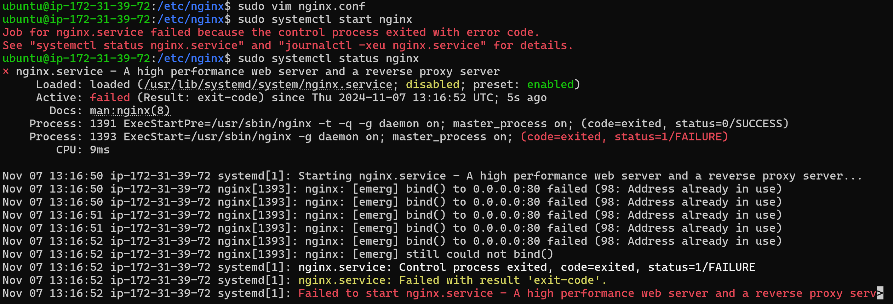

# 驗屍報告

## 檢查過程

- 先啟動跟檢查 nginx 狀態。


- 發現 /etc/nginx/nginx.cong 多了一個分號。改掉分號之後重啟 nginx，但發現還是不行，如下圖。


- 發現是 port 80 正在被另一個程式使用，所以去查一下正在被哪一個程式占用，如下圖，可以發現 srv 正在使用。


- 關閉 srv 並且讓他 reboot 之後不要自動再次開啟。


- nginx 沒有問題了。


- 重新 curl 一次。


- 發現 reject port 80 的請求，所以把這個規則刪掉。


- 重新 curl 一次發現還是錯誤。


- 檢查 Nginx 配置文件中的 location 的設定。發現在 /etc/nginx/sites-available 裡面的 default 有 location 的相關設定。


- 更改 nginx 訪問資料夾的權限，就成功了。

權限數字的所有可能組合（0-7）：
0：沒有權限 (---)
1：執行權限 (--x)
2：寫入權限 (-w-)
3：寫入和執行權限 (-wx)
4：讀取權限 (r--)
5：讀取和執行權限 (r-x)
6：讀取和寫入權限 (rw-)
7：讀取、寫入和執行權限 (rwx)
假如讓擁有者沒有 "r" 的權限，那 nginx 就無法執行這個資料夾內的程式。

    ```
    sudo chown -R www-data:www-data /var/myweb
    // 這條命令將 /var/myweb 目錄及其下所有檔案的擁有者和群組更改為 www-data。
    // 這樣 Web 伺服器（如 Nginx 或 Apache）就能擁有適當的權限來訪問這些檔案。
    ```
    ```
    sudo chmod -R 755 /var/myweb
    // 這條命令設置 /var/myweb 目錄及其內部檔案和子目錄的權限為 755
    // 這意味著
    // 擁有者（www-data）可以讀取、寫入和執行檔案。
    // 同一群組的用戶和其他用戶只能讀取和執行檔案，但不能修改檔案。
    ```

- 查看該目錄的權限
    ```
    ls -ld /var/myweb
    ```
    
    第一個 d 代表是 directory，後面三個三個一組看，分別代表檔案所有者、同一群組、其他用戶的權限，rwx 分別是 read、write、execute。第一個 www-data 是擁有者（用戶名），第二個 www-data 是群組（用戶組名稱）。

- 查看該目錄下所有檔案的權限
    ```
    ls -l /var/myweb
    ```
    


- log files


## 進階題

1. reboot 機器後，還是好的嗎？
reboot 之後又掛掉了。
原因一: srv 又會自動開啟，解決方式就是 ```sudo systemctl disable srv```
原因二: 防火牆又會自動開啟，解決方式就是刪除拒絕 80 port 的規則，並且使用 ```iptables-save``` 來保存規則，讓 reboot 之後不會又抓到舊的規則。


2. 怎麼看到硬碟是滿的？怎麼找到這幾個檔案？

    
    上圖可以發現主要佔用空間的目錄是 /usr（1.5G）和 /var（5.3G），其中 /var 目錄占用了最多空間。
    接下來就是一層一層去找大檔案的確切位置。
    
    
    
    找到之後可以刪除這些 log 檔案，或看要什麼其他的處理方式。
    *** 題外話: 硬碟滿了的問題不知道為什麼沒有對我的系統造成問題，還是本來就不會有問題?希望老師上課能針對這一塊多做解釋，謝謝!

## 心得與想法

雖然一開始根本沒什麼頭緒，加上這是第一次全部在終端機進行操作，覺得很不熟悉也蠻挫折的，但是後來透過跟同學討論還有上網找資料後找出答案，就覺得蠻有趣的。能讓我們提早知道真正就業之後會遇到的各種問題我覺得非常實用，以後碰到相關問題相信都能迎刃而解。


ssh -i "D:\NCCU\Semester1_1\CloudNative\FirstEC2Key.pem" ubuntu@54.64.7.65