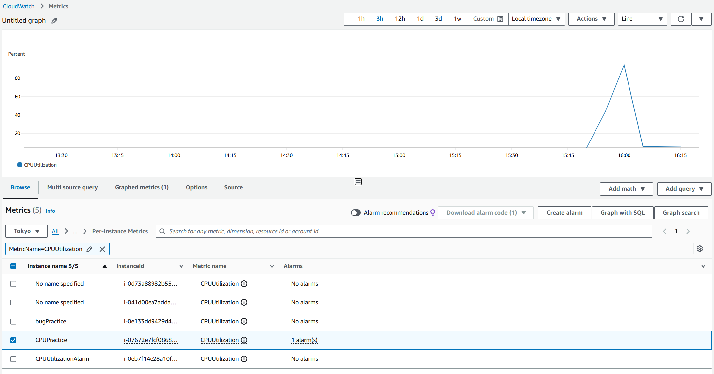
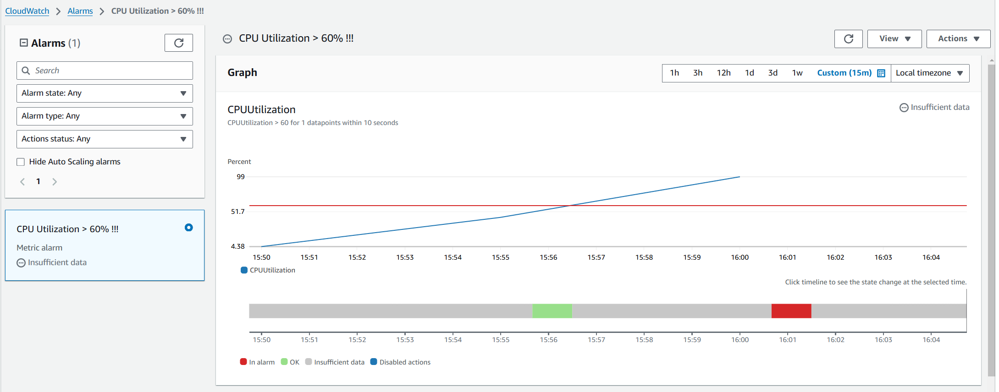
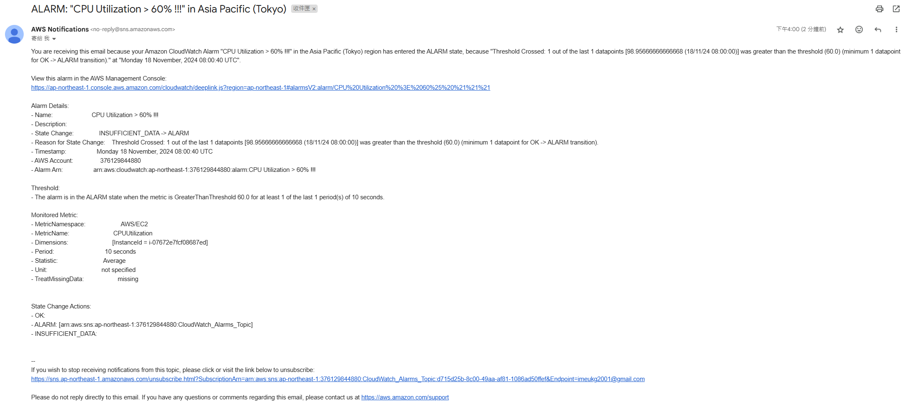
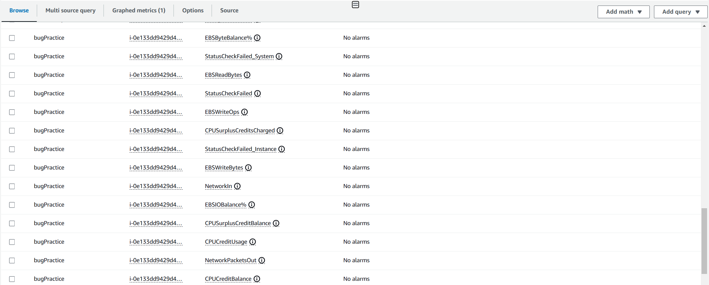
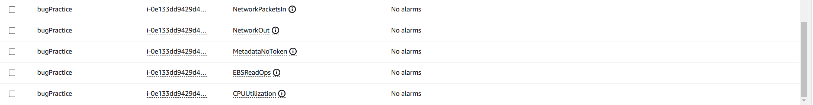

# Week-10

## 基礎題

### AWS CloudWatch Metrics - CPUUtilization 的截圖



### AWS CloudWatch Alarm 圖表的截圖



### Email 收到通知的截圖



## 進階題

not yet

---

## 其他研究

### AWS CloudWatch Metrics 中有哪些 EC2 instance 的 metrics
在 options 分類下的都是不一樣的 metrices，例如 EBSReadBytes、StatusCheckFailed 等等。



### stress-ng

- 安裝
```sudo apt install -y stress-ng```

- 模擬測試
```stress-ng --cpu 4 --cpu-load 90 --timeout 120s```
--cpu 4：使用 4 個 CPU 執行負載測試
--cpu-load 90：每個 CPU 的目標使用率為 90%
--timeout 120s：運行 120 秒後自動停止